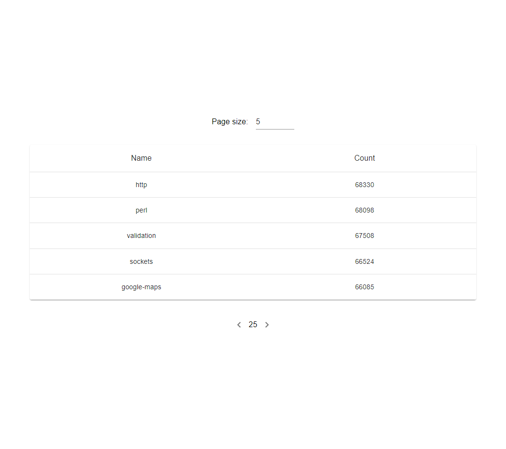

# Recruitment task

## Table of Contents

- [Description](#description)
- [Installation](#installation)
- [Usage](#usage)
- [Features](#features)

## Description

The goal of the task was to implement React app using stackexchange API endpoint. Endpoint returns StackOverflow tags.

## Installation

To install the app run

```
npm ci
```

To start the app run

```
npm start
```

To run Storybook use

```
npm run storybook
```

To run tests use

```
npm test
```

## Usage

|                                                                                     |                                                                                                       |
| :---------------------------------------------------------------------------------: | :---------------------------------------------------------------------------------------------------: |
|                   _1. Home page_                    |                 _2. Loading tag(s)_                  |
|     _3. Diffrent page size_       |           _4. No tags found info with error shown_            |
| _5. Example error message_  | _6. loading after no tags found_  |

## Features

- Fetching data from API endpoint
- Switch between diffrent items per page numbers
- Go through tag pages using pagination
- Sort data clicking on column name
- Storing sort column, sort order, page size and current page in URL
